Magic Optimizerを起動する

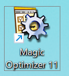

移行タブを選択し

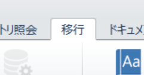

辞書の作成をクリックする
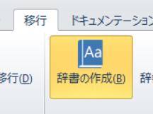

分析プロジェクトを選択して可視化を押します

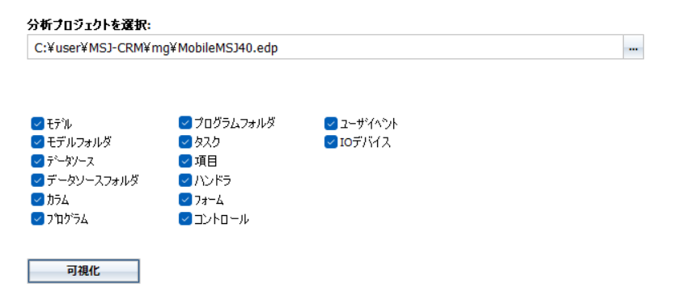

google翻訳ボタンをクリックします

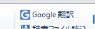

gogleAPIを用意して
https://console.cloud.google.com/apis/library

google翻訳開始ボタンをクリックする

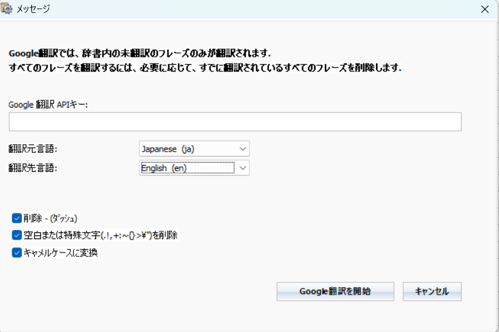

右側に翻訳された文が表示されます。

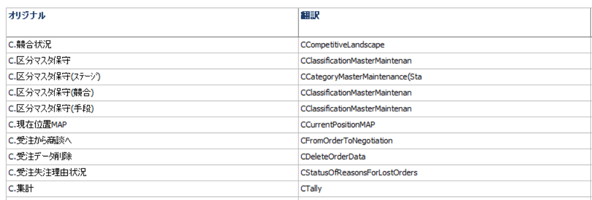

アプリケーションの準備ボタンをクリックします

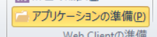

フォーム、コントロール、ユーザーイベントのみチェックをつけます。

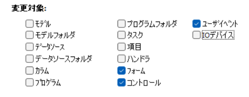

アプリケーションを準備ボタンをクリックります。

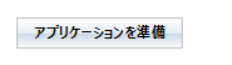

翻訳されます

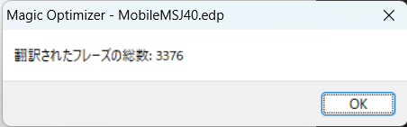