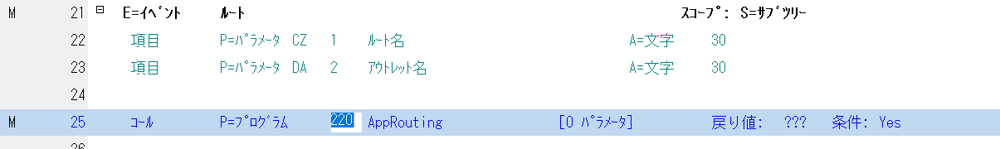
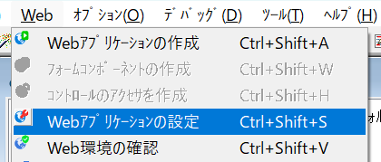
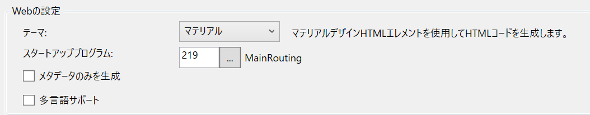
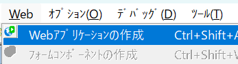
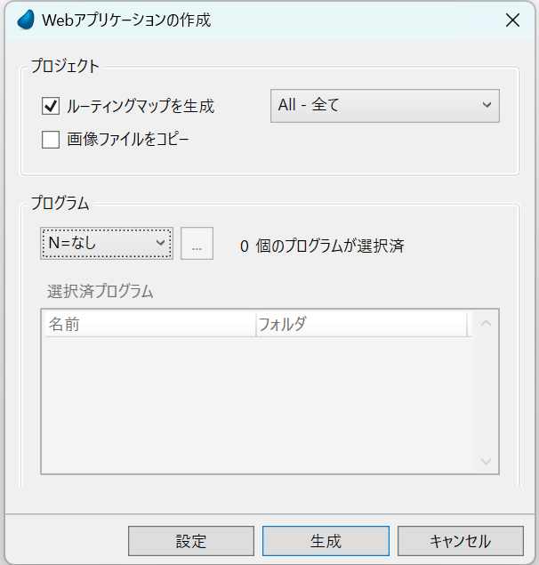

## Webアプリケーションの設定

webプロジェクト名「ng」

Webアプリケーションフォルダ「..」

メインプログラムに以下の変数を追加する

MainPrograms.xmlをインポートする

取り込んだMainRouting処理の
7,10,11,12行目が間違っているので修正する

から

25～28行目を削除する

AppRouting.xmlを取り込む

以下の2つのフォルダができています。

MainRoutingからAppRoutingを呼び出します。

# Angularの作成

Webアプリケーションの設定を起動します。

MainRoutingをスタートアッププログラムに設定します。

Webアプリケーションの作成を選択します

プログラム「なし」、ルーティングマップを作成「ALL」を設定し「生成ボタン」を押します。

