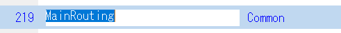

node_modules\@magic-xpaを配布のものと入れ替える

src\app\magicに_Customを展開する

src\appにmaterial-module.tsを設定する。

# src\app\app.module.tsの修正

importを追加する

```
/**
 * カスタムオーバーレイ
 */
import { OverlayContainerMagicProvider } from '@magic-xpa/angular';
import { OverlayContainer } from './magic/_Custom/custom-overlay/custom-overlay';
import { OverlayContainerProvider } from './magic/_Custom/custom-overlay/custom-overlayProvider';

import { MaterialModule } from './material-module';
```

declarationsにOverlayContainerを追加する

```
  declarations: [
    AppComponent,
    OverlayContainer,
  ],
```
entryComponentsを追加する

```
  entryComponents: [
    OverlayContainer,
  ],
```

providersに追加する
```
{
    provide: OverlayContainerMagicProvider,
    useClass: OverlayContainerProvider,
  },
```

 imports:に追加する
```
MaterialModule
```

# src\app\magic\magic.gen.lib.module.tsの修正

importの追加

```
// カスタムアラート
import { ConfirmationComponentsMagicProvider } from "@magic-xpa/angular";
import { CustomAlertComponent } from './_Custom/custom-alert/custom-alert.component';
import { customConfirmationMagicProviderService } from './_Custom/customConfirmationMagicProviderService';
import { CustomCnfComponent } from './_Custom/custom-cnf/custom-cnf.component';

import { MaterialModule } from '../material-module';
```

declarationsの変更
```
declarations: [
    ...magicGenComponents,
    CustomAlertComponent,
    CustomCnfComponent,
  ],
  ```

providersの変更

```
   providers: [ExitMagicService, { provide: ConfirmationComponentsMagicProvider, useClass: customConfirmationMagicProviderService }],
```

  imports:への追加

```
MaterialModule
```

srcにscssを展開する

# angular.jsonの変更

"styles"の変更。"src/scss/style.scss"を追加する。

```
"styles": [
    "src/styles.css",
    ".//src/magic-styles.css",
    "src/scss/style.scss"
],
```


各遅延フォルダのmagic.gen.lib.module.tsへの追加

```
import { MaterialModule } from '../../material-module';
```

imports:へ追加

```
MaterialModule
```


# tailwindcssを導入する

ターミナルを使ってtailwindcssをインストールする。

npm install tailwindcss@3

npx tailwindcss init

# tailwind.config.jsを修正する

```
/** @type {import('tailwindcss').Config} */
module.exports = {
  purge: {
    content: ['./src/**/*.{html,ts}'],
    enabled: process.env.TAILWIND_MODE === 'build',
  },
  content: [],
  theme: {
    extend: {},
  },
  plugins: [],
}

```

# tsconfig.jsonのcompilerOptionsに以下の３行を追加する

```
"strictNullChecks": false,  /* 厳密なヌルチェックを有効にします。 */
"noImplicitAny": false,     /* 暗黙の 'any'型で式と宣言のエラーを発生させます。 */
"noImplicitThis":false,     /* 暗黙の 'this'使用で式と宣言のエラーを発生させます。 */
```


Magic側に戻ってMainRoutingの上でCTRL+SHIFT+Aを押してプログラムを作成する



AppRoutingの上でCTRL+SHIFT+Aを押してプログラムを作成する


Angularに戻って"src\app\magic\Common\MainRouting"
の入れ替え


src\index.htmlに追加する

```
  <link href="https://fonts.googleapis.com/icon?family=Material+Icons" rel="stylesheet">
```