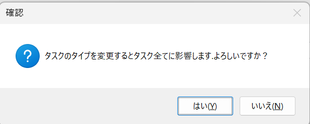

テンプレートの特性上、ログインしていない場合ログイン画面を表示することになっていますのでログイン画面から作成することになります。

ログインとメニュープログラムに関して遅延フォルダに入れずCommonフォルダにて管理します。

プログラム名を英数字に変更します。

オンラインの部分を英数字に変更します。

# CLoginタスクの処理

CTRL+Pを押してタスク特性を出してインタフェースを選択します。

メインフォームを削除します。

一番上のフォームをプログラム名と同じくします。

また、一番上のフォーム以外は削除します。

この作業を行わないと余計なプログラムがAngularに出力され重たいシステムになります。

タスクタイプをリッチクライアントからWebClietntに変更します。

「はい」を選択します。

「はい」を選択します。

リッチクライアント表示形式のフォームを削除します。

タブレットサイズの変更部分プログラムは今回関係ないので削除します。

チェック結果をだし潰していきます。

イメージボタンは全てプッシュボタンに変更します。

プログラム名をルート名に設定します。ただし「ログイン」だけは「**」と設定します。

Login、Logout、初期メニューはCommonフォルダに設定します。

ルート名が「**」のものは一番最後でコールします。

MainRoutingプログラムの17-18行目を修正します。

プログラムを作成します。CLoginのうえでCTRL+SHIFT+Aを押します。

ルーティングマップには「メイン」を選択します。

出力したhtmlは拡張子を.tw.htmlに変更します。

tw:Tailwindcss、bs:bootstrap、io:ionic

tsファイルのtemplateUrl: './CLogin.component.html'をtemplateUrl: './CLogin.component.tw.html'に変更します。

この変更を行うことで間違ってMagicからフォームを出力してもtw.htmlファイルは守られます。

あとはHTMLを整えます。
