C.得意先マスタ一覧の設定を行います。

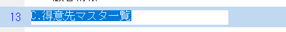

保存済みの日本語、英数字変換ファイル(C:\user\MSJ-CRM\mg\Jp-En.dic)より「C.得意先マスタ一覧」を探して変換します。

プログラム名を変更してフォルダもApp(遅延フォルダ)に変更します。

タスク名も同様に変更します。

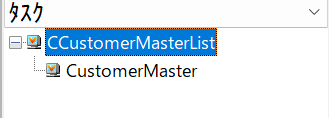

タスクタイプをWebClientに変更します。

「はい」を選択します。

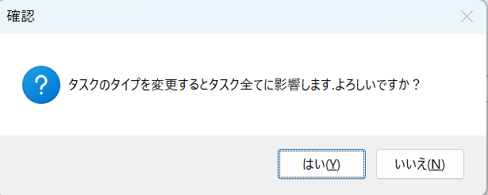

「はい」を選択します。

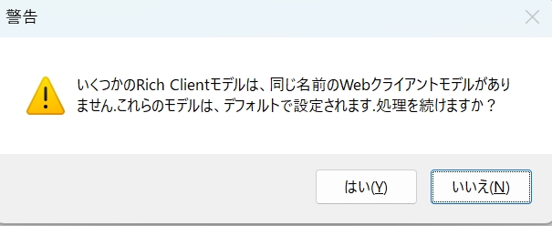

ルート名をプログラム名と一緒にします

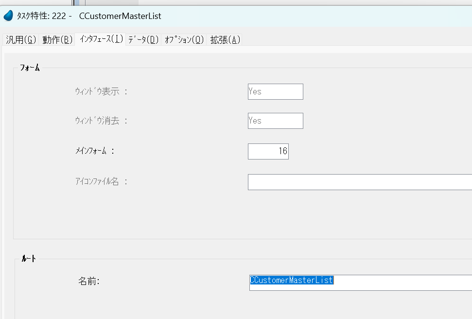

フォーム名をタスク名と一緒にして自分以外をすべて削除します。

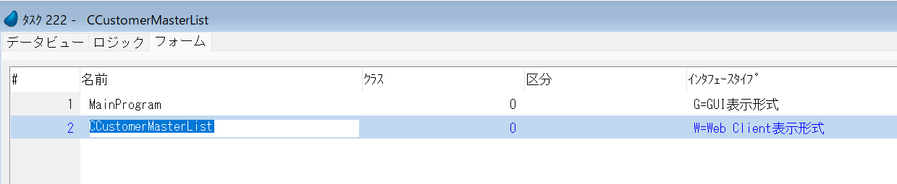

エラーを解消します

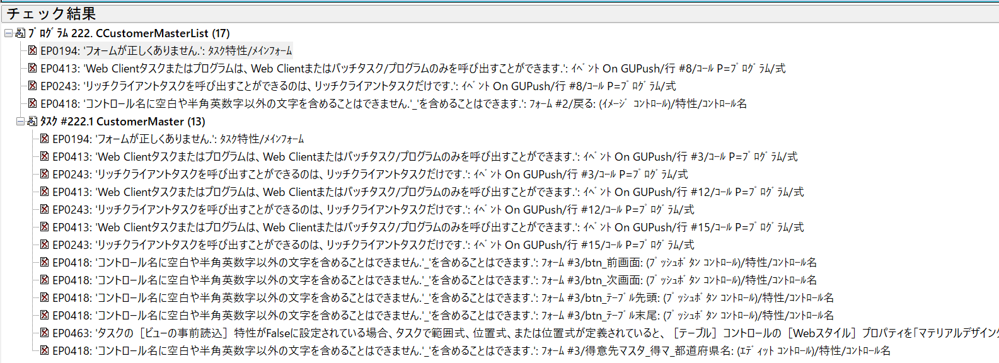

テーブルにはページネーションがすでにあるので削除します。

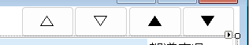

テーブルコントロールのあるタスクはビュー事前読込をYesに変更します。

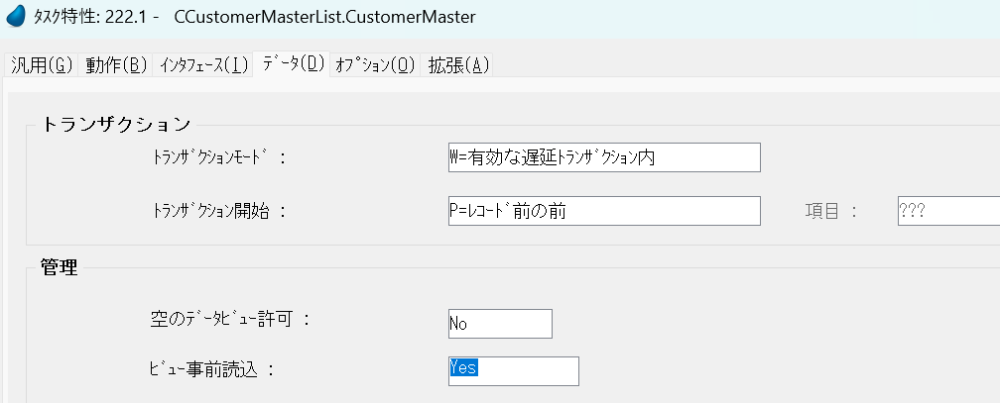

エラーがなくなったらAppRoutingのルートイベントにプログラムを追加します。

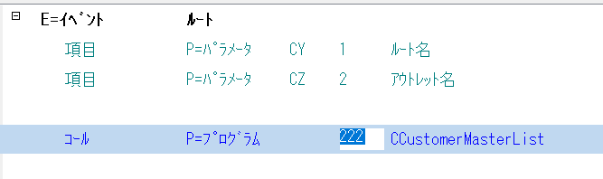

CCustomerMasterListプログラムの上でCTRL+SHIFT+Aを押します。

Appのルーティングマップも作成します。

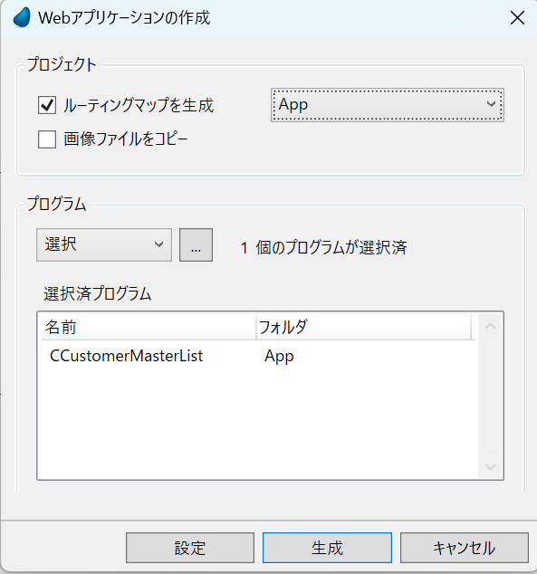

# 修正ルール

イメージボタンはプッシュボタンに変更してください。

